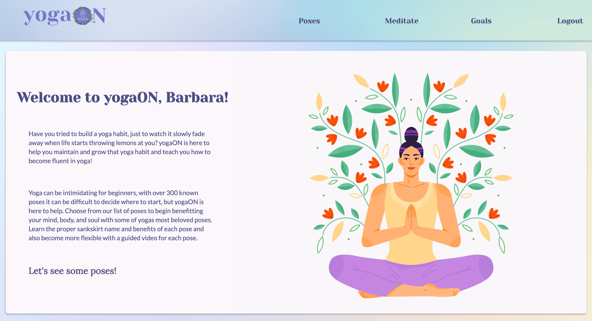
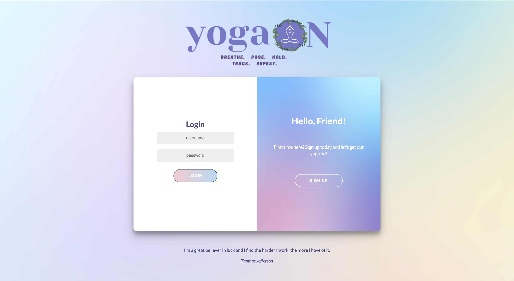
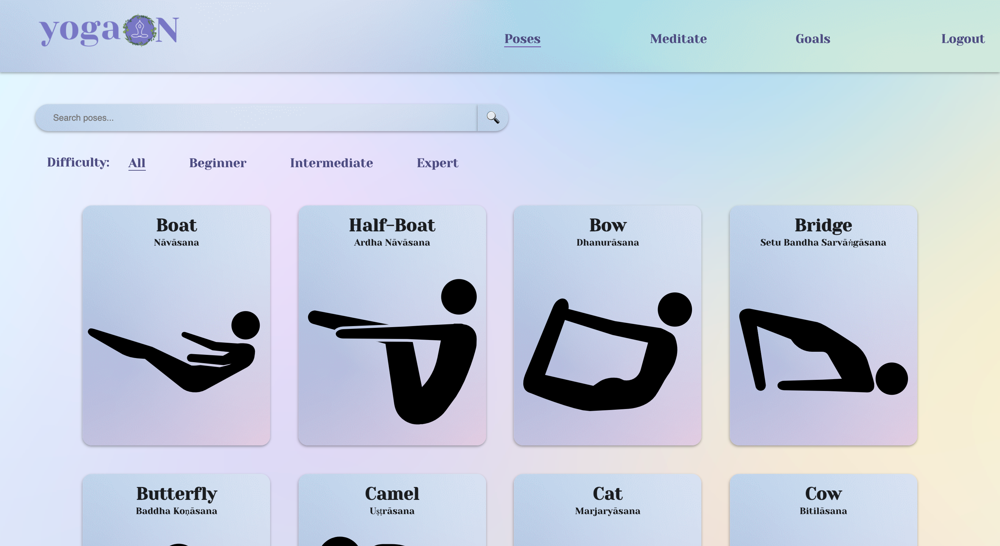
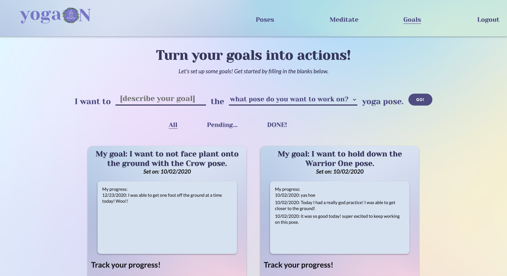
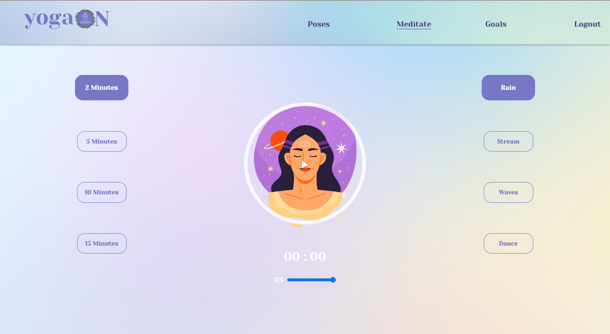

This project was bootstrapped with [Create React App](https://github.com/facebook/create-react-app).

# yogaON 
 A zen space for users to browse through yoga poses, track their goals, and meditate!
 
## Description

yogaON was created to help me maintain and track my yoga habit. Users can sign up for account, user authentication is implemented through use of sessions and Bcrypt. Once your signed in you can browse through over 40 yoga poses and each is accompanied with a detailed description on how to do the pose, a how-to video, and benefits. You can also set goals for yourself and track your progress with that goal every day! Best of all, if you are feeling overwhelemed you can chill out and meditate! 
 
# Getting Started

 ## Prerequisites
 
  1. To clone and run this application, youll need Git and Node.js  
  2. Fork and Clone [yogaON BackEnd](https://github.com/barbarabontempo/yogaon-backend)
  3. Install [Node.js and NPM](https://www.npmjs.com/get-npm)
   `brew install node`
  4. Run '$ rails s' in the folder that contains the yogaON BackEnd
  
## Starting the Frontend Server

 1. Fork and Clone this repository and cd into directory
 2. Install all dependencies\
  `$ npm install`
 3. Start the Frontend server this should open a webpage for you if not go to http://localhost:3001 \
 `$ npm start`
 4. Type `$ y` or `$ yes` when prompted
 
## How To Use

  When first starting up the application you will need to sign up with an username email and password. Once you are signed up you will be directed to the homepage and the fun will begin! You can browse through over 40 yoga poses, start some new goals, and meditate!

### Want to contribute?

Make a pull request in a diffrent branch and do not fork :D 

## Visuals

  
 Login Page 
 
    

  
 Poses 
 
    

  
 Goals 
 
    

  
 Meditate 
 
    

## Contributing
Pull requests are welcome. For major changes, please open an issue first to discuss what you would like to change.

Please make sure to update tests as appropriate.

[Go To Top](#Description)

